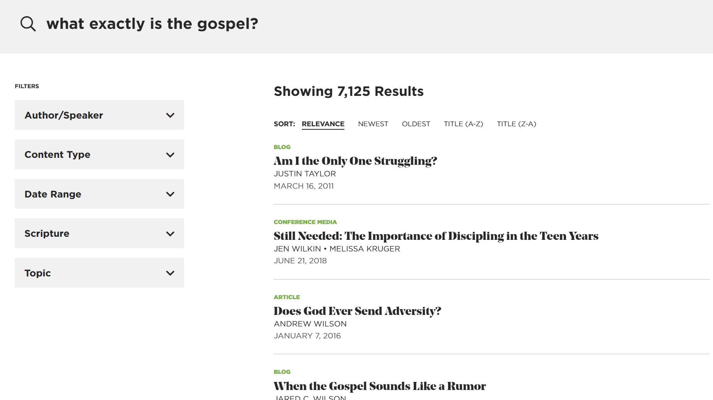
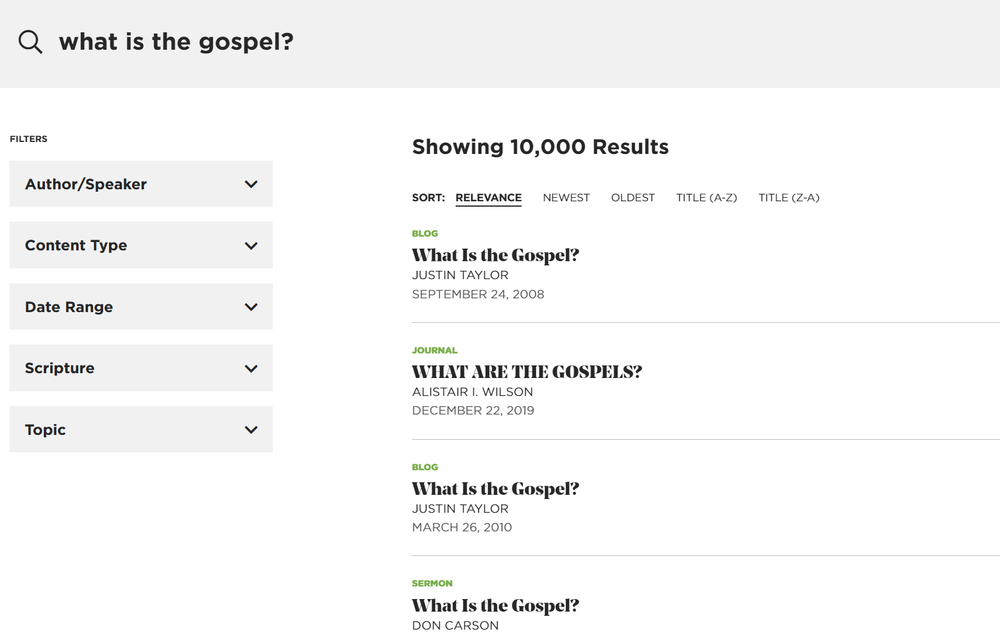

# TGC Semantic Search Demo


> NOTE: I am not affliated with nor endorsed by The Gospel Coalition; this coding work and any errors herein are entirely my own. Any article content from the scraper is entirely the work of The Gospel Coalition.

Inspired by [Stack Overflow's semantic search article](https://stackoverflow.blog/2023/07/31/ask-like-a-human-implementing-semantic-search-on-stack-overflow/) (yes, I'm quite late to this party), I thought I'd try my hand at applying semantic search to a website I love with a regrettably mediocre search feature (at least at the time of writing): [The Gospel Coalition](https://www.thegospelcoalition.org/).

## Installation

> This project uses [poetry](https://python-poetry.org/) as a dependency manager

```sh
poetry shell
poetry install
```

## Usage

```sh
# download recent articles
python -m tgc_semantic_search_demo.scraper
# refresh only needs to be used when new articles have been downloaded
python -m tgc_semantic_search_demo.search "put your search query here" -n 5 --refresh 
```

## Run Tests

```sh
python -m pytest
```

## The Essay After The Recipe

While TGC's keyword-based search *works*, it often has trouble pulling up articles I know I've read before, and sometimes the results are just...off. It certainly doesn't handle semantic questions well:



...even though a simple change of phrase shows there's PLENTY of relevant content:



So, I thought I'd go ahead and jump on the language model bandwagon and try implementing a basic, better search demo for TGC articles (for now just as a locally-run trial-run). I did this in 3 parts:

-   Scrape the last few hundred articles from the TGC website
-   Encode the article content (per-paragraph) using a trained model into a vector database
-   Search the vector database semantically using an encoded query (from the command line, because I am too lazy for throwaway GUIs)

*Original, you see.* It was criminally easy to set up the model + encoding with third-party libraries, but that's the beauty and danger of OSS in 2023. Mostly the beauty.

This was still a fun project and, subjectively, the search does seem to be improved! I'd like to try it on a larger pool of articles (maybe try scraping all ~50,000?) and improve the searching speed to see how well this'd scale, but overall, I'm quite happy with getting this working as a weekend project.